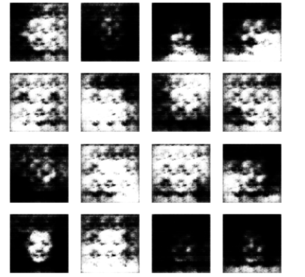
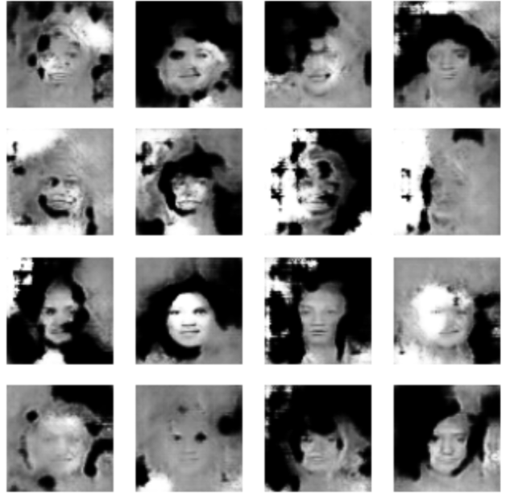
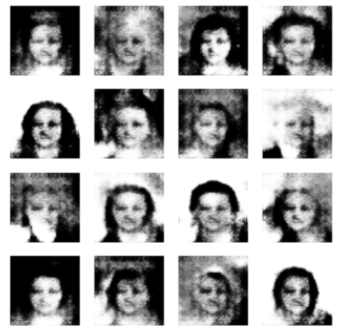

Тема роботи: Розширення датасетів зображень на основі нейронної мережі GAN

Тестовий код, далекий до закінчення.

Вибрав датасет CelebA - датасет з зображенням лиць відомих людей, розмы.
Мета: навчити нейромережу генерувати зображення облич людей.

Поки навчання йде на 10к зображень, фото в відтінках сірого, розміром 64х64

Результат на даний момент:

